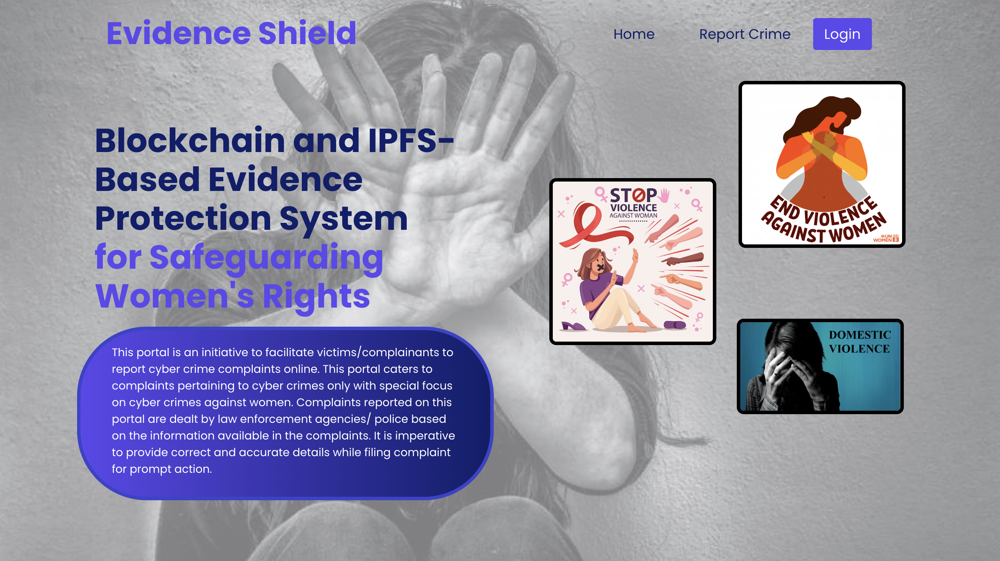

# Evidence Shield: Decentralized Evidence Management System


**Evidence Shield** is a decentralized evidence management platform built on Ethereum and IPFS. It securely registers cases, uploads evidence, and retrieves reports using smart contracts, MetaMask authentication, and IPFS storage. Awarded 2nd prize at DIPEX'24 and protected by Intellectual Property India, Evishield ensures transparency, security, and efficiency in the reporting and investigation of crimes.

---

## Table of Contents

- [Features](#features)
- [Modules & MetaMask Integration](#modules--metamask-integration)
- [Technology Stack](#technology-stack)
- [Setup & Installation](#setup--installation)
  - [Blockchain & Smart Contracts](#blockchain--smart-contracts)
  - [Backend Server](#backend-server)
  - [Frontend Application](#frontend-application)
  - [MetaMask Setup](#MetaMask-setup)
- [Snapshots](#snapshots)
- [Achievements](#achievements)
- [License & Copyright](#license--copyright)
- [Contact](#contact)

---

## Features

- **Secure Case Registration:** Cases are registered on Ethereum with evidence uploaded to IPFS.
- **Role-Based Access:** Different modules for complainants, police, labs, hospitals, courts, and legal authorities.
- **Real-Time Interaction:** Use of MetaMask for authentication and transaction signing.
- **Immutable Storage:** Smart contracts ensure case details and evidence mappings are tamper-proof.
- **Decentralized Evidence Management:** Upload and retrieval of evidence (PDFs, images, audio, video, etc.) with IPFS.

---

## Modules & MetaMask Integration

Different modules work together to streamline the reporting and investigation of crimes, ensuring transparency, security, and efficiency throughout the process.

- **Complaint Registration Module:**  
  - Complainants register complaints via their MetaMask accounts (with the option for anonymity).
  - Detailed crime information is provided, including victim name, incident location, crime details, and evidence.
  - Multiple evidences are uploaded in various formats (PDF, image, audio, video, etc.).
  - Each piece of evidence is stored on IPFS, generating unique IPFS hashes.
  - Complaint details and IPFS hashes are structured into a JSON file, which is also uploaded to IPFS.
  - A unique Case ID is generated and mapped to the JSON IPFS hash, then securely stored on the Ethereum blockchain.

- **Police Access Module:**  
  - Authorized police personnel access case details via MetaMask, review complaints, and initiate investigations.
  - Additional evidence can be collected and securely stored on IPFS, linked to the original Case ID.

- **Lab Analysis Module:**  
  - Lab personnel submit physical evidence for analysis via lab-specific MetaMask logins.
  - Lab reports are uploaded to IPFS and linked to the corresponding Case ID.

- **Hospital Feedback Module:**  
  - Hospitals access lab reports and provide feedback using their MetaMask accounts.
  - Feedback reports are stored on IPFS and mapped to the original Case ID.

- **Evidence Viewing Module (Complainant Access):**  
  - Complainants view uploaded evidence, lab reports, and feedback by logging in through MetaMask and entering the Case ID.

- **Legal Access Module:**  
  - Court authorities and lawyers gain access to comprehensive case details for effective legal representation.

- **Blockchain Integration Module:**  
  - Integrates with the Ethereum blockchain to store immutable records of case details and evidence mappings via smart contracts.

- **Authentication & Authorization Module:**  
  - Manages user authentication by storing MetaMask addresses on the Ethereum blockchain for seamless access control.

*Tools & Versions Used:*  
- **MetaMask:** v11.14.0  
- **IPFS (Pinata):** v2.0.1  
- **Ethereum Blockchain:** v2.0 (with smart contracts written in Solidity v0.5.16)  
- **Web3.js:** v1.10.0  
- **Node.js:** v20.11.0  
- **Truffle Framework:** v5.11.5  
- **Ganache:** v7.9.1  
- **React.js:** for building the frontend  

---

## Technology Stack

- **Blockchain & Smart Contracts:** Ethereum, Ganache, Truffle, Web3.js
- **Frontend:** React, React Router, TailwindCSS, Bootstrap
- **Backend:** Node.js, Express, Axios, dotenv
- **Decentralized Storage:** IPFS (via Pinata)
- **Wallet Integration:** MetaMask

---

## Setup & Installation

### Blockchain & Smart Contracts

1. **Install Ganache:**  
   Download and run [Ganache](https://www.trufflesuite.com/ganache) on `http://127.0.0.1:7545`.

2. **Deploy Contracts:**  
   In your Truffle project directory, run:
   ```bash
   truffle compile
   truffle migrate --network development
   ```
  This deploys the smart contracts to Ganache.

3. Environment Variables:
Create a .env file in your backend directory with:
```bash
senderAddress=0xYourSenderAddress
policeAddress=0xYourPoliceAddress
hospitalAddress=0xYourHospitalAddress
labAddress=0xYourLabAddress
courtAddress=0xYourCourtAddress
```

### Backend Server
Install Dependencies:
Navigate to the backend folder and run:
```bash
npm install
```

Start the Server:
Run:
```bash
node index.js
```

The server will run on port 8080.

### Frontend Application
Install Dependencies:
In your frontend folder, run:
```bash
npm install
```

Start the React App:
Run:
```bash
npm start
```
The app will launch at http://localhost:3000.

### MetaMask Setup
Install MetaMask in your browser.
Add a custom RPC network pointing to http://127.0.0.1:7545.
Import one of your Ganache accounts for transaction signing.


## Snapshots
Below are snapshots of the project in action:
### 1.


This interface features the title of our project, 
“Evidence Shield Blockchain and IPFS based Evidence Protection System for 
Safeguarding Women’s Rights,” along with an intuitive overview of our portal, 
providing users with a glimpse of its purpose and functionality.

---

### 2.


Upon scrolling down the homepage, users encounter relevant women-related 
cases and statistics, including the number of cases registered and successfully 
handled by the portal.

---

### 3.


It serves as a guide for complaint registration and features a 
“Login with Metamask” button for initiating the registration process securely.

---

### 4.


After clicking the “Login with Metamask” button and detecting the Metamask 
address, users land on this interface. It contains fields for entering crime 
details, victim information, incident location, and a description of the crime. 
Additionally, users can upload evidence files in various formats such as audio, 
video, or docx. Upon submission, users are redirected to the complainant’s login interface.

---

### 5.


This page provides options for users to track their complaints, view existing 
complaints, and report new crimes, ensuring transparency and accessibility 
throughout the complaint management process.

---

### 6.


Users enter their case ID to track the progress of their complaint.

---

### 7.


This page displays a progress bar indicating the current status of the case, 
providing users with real-time updates on their complaint’s status.

---

### 8.


After clicking the “Login with Metamask” button, police personnel access this 
page, which features an option to view existing complaints.

---

### 9.


Upon login, police officers can view a table displaying registered complaints, 
including case IDs, crime details, uploaded evidence, and options for uploading 
additional evidence and final investigation reports.

---

### 10.


It provides laboratory personnel with the option to upload lab reports after 
logging in securely with Metamask.

---

### 11.


Upon login, laboratory staff can view a table displaying case IDs and upload 
lab reports for corresponding cases, ensuring efficient management and analysis 
of forensic evidence.

---

### 12.


Hospital staff access this page after logging in with Metamask, where they 
can view existing complaints.

---

### 13.


Upon login, hospital personnel can view a table displaying case IDs and 
associated lab reports, providing them with the necessary information to review 
and upload hospital feedback for respective cases.

---

### 14.


It allows court authorities to check updates on cases after securely logging 
in with Metamask.

---

### 15.


Upon login, court officials can view details of registered complaints, 
including uploaded evidence, lab reports, hospital feedback, and final investigation 
reports. They also have the option to provide case verdicts.

---

### 16.


The Case Summary and Verdict Report outlines key case details, including 
evidence uploaded by the complainant and police, forensic laboratory reports, hospital 
feedback, and the court verdict. It concludes with a brief final statement, summarizing 
the court’s decision.

---

## Achievements
🏆 2nd Prize in DIPEX'24
Awarded at the State Level Exhibition cum Project Competition in India.

🛡 Intellectual Property Secured
This project is copyrighted by Intellectual Property India, granted by the Government of India.

---

## License & Copyright
© 2024 Evishield.
All rights reserved.
Protected under Intellectual Property India.

---

## Contact

For any questions or feedback, please contact us at pprajakta1406@gmail.com

Thank you for exploring our Evidence Protection System. If you find this project useful, please consider starring the repository on GitHub!


